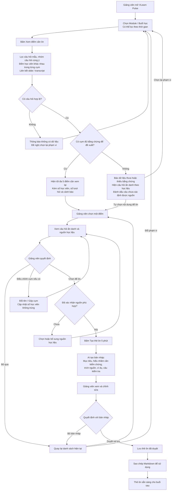

# CP2 — Luồng hoạt động VLearn Pulse

## 1. Mục tiêu

Giúp giảng viên xác định những nội dung cần ôn sau buổi học,
kiểm tra bằng chứng từ câu hỏi của học viên và học liệu,
sau đó chuẩn bị thẻ ôn 5 phút cho buổi tiếp theo.

AI hỗ trợ tổng hợp và tạo bản nháp. Giảng viên quyết định
nội dung cần ôn và phê duyệt trước khi sử dụng.

## 2. Người dùng và tình huống sử dụng

- **Người dùng chính:** Giảng viên.
- **Thời điểm:** Sau buổi học, khi chuẩn bị nội dung cho buổi tiếp theo.
- **Đầu vào:** Hội thoại học viên với VLearn Tutor và slide/transcript.
- **Đầu ra:** Thẻ ôn 5 phút đã được duyệt, lưu và có thể sao chép Markdown.

## 3. Sơ đồ luồng

## 4. Mô tả các bước

| Bước | Người thực hiện | Thao tác và kết quả |
|---|---|---|
| 1. Chọn phạm vi | Giảng viên | Chọn Module/buổi học, có thể lọc thêm theo thời gian |
| 2. Yêu cầu báo cáo | Giảng viên | Bấm “Xem điểm cần ôn” để bắt đầu phân tích |
| 3. Tiền xử lý | Hệ thống | Lọc câu hỏi mẫu, nhóm câu hỏi cùng ý, đếm học viên khác nhau và liên kết học liệu |
| 4. Kiểm tra dữ liệu | Hệ thống | Nếu không có câu hỏi hợp lệ, đề nghị chọn lại phạm vi; nếu dữ liệu thưa, vẫn cho xem câu hỏi ẩn danh |
| 5. Hiển thị đề xuất | Hệ thống | Hiện tối đa 5 cụm đủ bằng chứng; không cố tạo đủ 5 cụm |
| 6. Kiểm chứng | Giảng viên | Chọn một điểm, xem câu hỏi minh họa và slide/transcript liên quan |
| 7. Điều chỉnh | Giảng viên | Có thể đổi tên, gộp cụm hoặc bỏ qua đề xuất không phù hợp |
| 8. Xác nhận nguồn | Giảng viên | Kiểm tra nguồn phù hợp; chọn hoặc bổ sung nguồn nếu còn thiếu |
| 9. Tạo thẻ ôn | Hệ thống | Tạo bản nháp thẻ ôn 5 phút cho nội dung giảng viên đã chọn |
| 10. Duyệt nội dung | Giảng viên | Xem, chỉnh sửa, bỏ bản nháp hoặc duyệt và lưu |
| 11. Sử dụng | Giảng viên | Sao chép Markdown để đưa nội dung vào tài liệu hoặc bài giảng |

Khi dữ liệu thưa, giảng viên có thể tự chọn nội dung từ danh sách
câu hỏi để ôn. Hệ thống không gọi nội dung được chọn thủ công này
là điểm nghẽn phổ biến của lớp.

## 5. Nguyên tắc xử lý và kiểm tra dữ liệu

### Lọc nhiễu và đếm học viên

- Loại câu hỏi mẫu được đánh dấu `is_preset` khỏi phân tích chính.
- Nhóm các câu hỏi có cùng ý nghĩa theo khái niệm.
- Một học viên chỉ đóng góp tối đa một lượt đếm trong mỗi cụm,
  dù hỏi nhiều lần về cùng chủ đề.
- Vẫn giữ các câu hỏi phù hợp làm bằng chứng.
- Khi gộp cụm, tính lại số học viên khác nhau để tránh đếm trùng.
- Chỉ hiển thị thống kê tổng hợp và câu hỏi đã ẩn danh.

### Kiểm tra bằng chứng

Việc đề xuất một cụm cần xem xét:

- Số câu hỏi hợp lệ sau khi lọc.
- Số học viên khác nhau trong cụm.
- Mức độ liên quan giữa các câu hỏi.
- Bằng chứng liên kết với slide hoặc transcript.

CP2 chưa chốt ngưỡng số cụ thể. Ngưỡng sẽ được thử nghiệm và
ghi trong spec; không mặc định rằng có từ 10 câu hỏi là đủ tin cậy.

Ít câu hỏi không đồng nghĩa với việc lớp đã hiểu.
Thiếu nguồn học liệu phải được thông báo rõ, không tạo trích dẫn giả.

## 6. Thông tin của mỗi điểm cần xem lại

- Tên khái niệm hoặc chủ đề.
- Số học viên khác nhau đã hỏi.
- Tổng số lượt hỏi, hiển thị riêng với số học viên.
- Một đến hai câu hỏi minh họa đã ẩn danh.
- Trang slide hoặc đoạn transcript liên quan.
- Cảnh báo nếu dữ liệu hoặc bằng chứng còn hạn chế.
- Thao tác xem chi tiết, đổi tên, gộp cụm hoặc bỏ qua.

Các đề xuất hỗ trợ giảng viên ra quyết định, không phải kết luận
chắc chắn về mức độ hiểu của cả lớp hay từng học viên.

## 7. Nội dung thẻ ôn 5 phút

1. **Mục tiêu ôn:** Học viên cần hiểu được điều gì sau phần ôn.
2. **Hiểu nhầm cần kiểm chứng:** Vấn đề được gợi ý từ câu hỏi.
3. **Trích dẫn nguồn:** Nội dung liên quan từ slide hoặc transcript.
4. **Ví dụ giải thích:** Một ví dụ ngắn để làm rõ khái niệm.
5. **Câu kiểm tra hiểu:** Trắc nghiệm hoặc câu trả lời ngắn.

“5 phút” là thời lượng ôn tập dự kiến.

Thẻ mới tạo ở trạng thái bản nháp. Giảng viên phải xem và duyệt
trước khi thẻ được lưu ở trạng thái đã duyệt.

## 8. Các tình huống rẽ nhánh

| Tình huống | Cách xử lý |
|---|---|
| Không có câu hỏi hợp lệ | Thông báo và cho chọn lại phạm vi |
| Có câu hỏi nhưng chưa đủ bằng chứng đề xuất | Hiện câu hỏi ẩn danh theo học liệu để giảng viên tự xem |
| Câu hỏi chưa xác định được nguồn | Đánh dấu rõ và cho giảng viên chọn nguồn phù hợp |
| Tên cụm chưa đúng hoặc hai cụm trùng ý | Giảng viên đổi tên hoặc gộp; hệ thống cập nhật thống kê |
| Đề xuất không phù hợp | Bỏ qua và quay về danh sách hiện tại |
| Thẻ ôn chưa phù hợp | Giảng viên sửa hoặc bỏ bản nháp |
| Thẻ ôn phù hợp | Duyệt, lưu và sao chép Markdown |

## 9. Phạm vi CP2

- Minh họa luồng bằng sơ đồ hoặc bản mock.
- Chưa yêu cầu AI chạy thật.
- Dữ liệu mẫu phải được ghi rõ là dữ liệu minh họa.
- Luồng chính: chọn buổi học → xem đề xuất → kiểm chứng
  → tạo thẻ → chỉnh sửa → duyệt, lưu và sao chép.
- Xuất PDF một trang là chức năng có thể bổ sung sau,
  chưa nằm trong phạm vi CP2 này.

Luồng hoàn thành khi giảng viên có một thẻ ôn đã duyệt
để sử dụng trong buổi học tiếp theo.