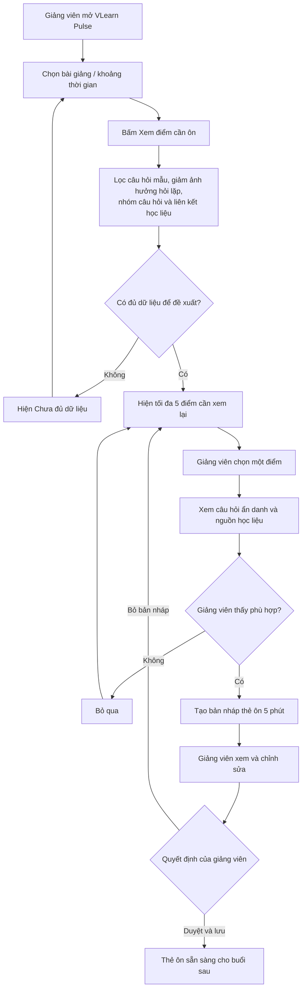

# CP2 — Luồng hoạt động VLearn Pulse

## 1. Mục tiêu

Giúp giảng viên xác định những nội dung lớp cần ôn lại thông qua
câu hỏi của học viên, kiểm tra bằng chứng từ học liệu và chuẩn bị
thẻ ôn 5 phút cho buổi học tiếp theo.

## 2. Người dùng và tình huống

- **Người dùng chính:** Giảng viên.
- **Thời điểm sử dụng:** Sau buổi học, trước khi chuẩn bị buổi tiếp theo.
- **Đầu vào:** Hội thoại học viên với VLearn Tutor và học liệu liên quan.
- **Đầu ra:** Thẻ ôn 5 phút đã được giảng viên duyệt và lưu.

## 3. Sơ đồ luồng

## 4. Mô tả các bước

| Bước | Thao tác hoặc xử lý | Kết quả |
|---|---|---|
| 1 | Giảng viên chọn bài giảng hoặc khoảng thời gian | Xác định phạm vi cần phân tích |
| 2 | Giảng viên bấm “Xem điểm cần ôn” | Hệ thống bắt đầu xử lý |
| 3 | Hệ thống lọc câu hỏi mẫu, giảm ảnh hưởng hỏi lặp và nhóm câu hỏi cùng ý | Các nhóm câu hỏi được liên kết với học liệu |
| 4 | Hệ thống kiểm tra dữ liệu | Hiện tối đa 5 điểm cần xem lại hoặc thông báo chưa đủ dữ liệu |
| 5 | Giảng viên chọn một điểm | Xem câu hỏi ẩn danh và nguồn học liệu để kiểm chứng |
| 6 | Giảng viên yêu cầu tạo thẻ ôn | Hệ thống tạo bản nháp thẻ ôn 5 phút |
| 7 | Giảng viên xem, chỉnh sửa và duyệt | Thẻ ôn được lưu để sử dụng trong buổi sau |

## 5. Thông tin của mỗi điểm cần xem lại

- Tên khái niệm hoặc chủ đề.
- Số học viên khác nhau đã hỏi về chủ đề.
- Số lượt hỏi, trình bày riêng với số học viên.
- Một đến hai câu hỏi minh họa đã ẩn danh.
- Trang slide hoặc đoạn transcript liên quan.
- Cảnh báo nếu dữ liệu còn ít.

Các điểm này là đề xuất để giảng viên xem xét, không phải kết luận
chắc chắn về mức độ hiểu của cả lớp.

## 6. Nội dung thẻ ôn 5 phút

1. Mục tiêu cần ôn.
2. Hiểu nhầm cần giảng viên kiểm chứng.
3. Trích đoạn học liệu liên quan.
4. Ví dụ giải thích ngắn.
5. Câu kiểm tra hiểu cuối phần ôn.

Giảng viên có thể chỉnh sửa hoặc bỏ bản nháp trước khi duyệt.
“5 phút” là thời lượng ôn tập dự kiến.

## 7. Các trường hợp rẽ nhánh

- **Chưa đủ dữ liệu:** Thông báo rõ và cho chọn lại phạm vi;
  không kết luận rằng lớp đã hiểu.
- **Điểm đề xuất không phù hợp:** Giảng viên bỏ qua và quay lại danh sách.
- **Bản nháp chưa phù hợp:** Giảng viên chỉnh sửa hoặc bỏ bản nháp.
- **Nội dung phù hợp:** Giảng viên duyệt và lưu thẻ ôn.

## 8. Phạm vi CP2

CP2 mô tả luồng hoạt động dự kiến, chưa yêu cầu AI chạy thật.
Nếu dùng dữ liệu mẫu để minh họa, nhóm sẽ ghi rõ đó là dữ liệu giả.

Luồng hoàn thành khi giảng viên đã duyệt và lưu một thẻ ôn
để sử dụng trong buổi học tiếp theo.